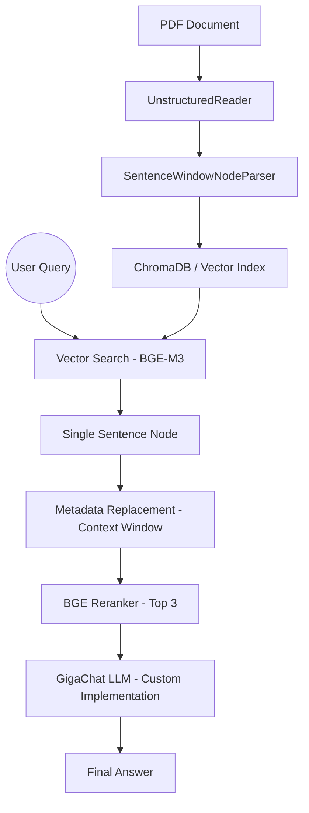

# Advanced LlamaIndex RAG Pipeline (GigaChat + Local BGE)

Продвинутый RAG-пайплайн на базе LlamaIndex, использующий локальные модели для поиска и **GigaChat** для генерации ответов. Оптимизирован для работы с PDF-документами с использованием техники **Sentence Window Retrieval**.

## Технологический стек

### Core (Ядро)
- **Python 3.10+**: Основной язык разработки.
- **LlamaIndex**: Фреймворк для создания RAG-приложений и управления данными.
- **GigaChat SDK**: Для интеграции с LLM от Сбера.

### AI & NLP Модели
- **GigaChat Lite**: Облачная языковая модель для генерации финальных ответов.
- **BGE-M3 (HuggingFace)**: Универсальная модель эмбеддингов для семантического поиска.
- **BGE-Reranker-Base**: Модель для перепроверки и ранжирования результатов поиска.

### Базы данных и Хранение
- **ChromaDB**: Локальная векторная база данных для векторов и метаданных.
- **Unstructured**: Библиотека для парсинга и очистки PDF-документов.

### Инструменты разработки
- **Git/GitHub**: Контроль версий и публикация.
- **Visual Studio Code**: Среда разработки.
- **Python-dotenv**: Управление конфигурацией и секретами.

## Архитектура системы

Система сочетает локальную приватность (поиск и хранение на вашем ПК) с мощностью облачных LLM.



## Ключевые особенности

- **Sentence Window Retrieval**: Вместо простых кусков текста извлекается конкретное предложение вместе с окружающим контекстом (окном), что дает LLM более глубокое понимание.
- **Локальный Reranking**: Модель `BGE-Reranker-Base` перепроверяет результаты поиска, значительно повышая релевантности ответов.
- **BGE-M3 Embeddings**: Использование одной из лучших open-source моделей для семантического поиска.
- **GigaChat Integration**: Кастомная интеграция GigaChat (Lite) через `CustomLLM` (в обход нестабильных библиотек).
- **Модульная структура**: Логика LLM вынесена в отдельный модуль для чистоты кода.

## Структура проекта

- `rag_pipeline.py`: Основной файл с логикой RAG.
- `llm_utils.py`: Утилиты для работы с GigaChat и настройки кодировки.
- `.env`: Файл для хранения API ключей (не публикуется).
- `chroma_db/`: Локальная векторная база данных.

## Как запустить

1. **Установите зависимости**:
   ```bash
   pip install llama-index gigachat unstructured chromadb llama-index-embeddings-huggingface llama-index-postprocessor-sentence-transformer-rerank llama-index-vector-stores-chroma
   ```

2. **Настройте ключи**:
   Создайте файл `.env` и добавьте:
   ```env
   GIGACHAT_CREDENTIALS=ваш_ключ
   GIGACHAT_SCOPE=GIGACHAT_API_PERS
   ```

3. **Запустите пайплайн**:
   ```bash
   python rag_pipeline.py "путь/к/файлу.pdf" "Ваш вопрос"
   ```

## Лицензия
MIT
